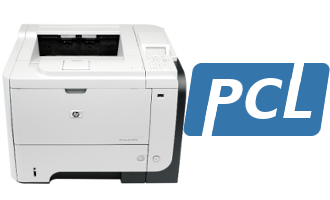

Hi, I'm currently reworking this README file for better presentation.

# Python PCL / ZPL


Python PCL / ZPL allows you to control directly Zebra Printer & HP Printer with ZPL and HP PCL languages from Python script.

## What is ZPL?
ZPL is a "tuned version" of PCL for Zebra label printer. Initially started for HP printers, this project evolved to support Zebra ZPL format. ZPL is now used every day with Zebra LP2824 Plus & Zebra GK420t at [MC Hobby](https://shop.mchobby.be).


## What is PCL?

PCL stand for "Printer Command Line". Meaning that some printer behavior (font, font size, bold, graphics, barcode) can be controled by including some special command inside the text stream being printer. Those special commands are usually introduced by the escape character (ASCII #27). As a result, such printer command are also commonly named "Escape Sequence".  



The advantage of PCL approach is to support advanced printer feature on:
1) Archaic development plateform (eg: Clipper, Habour Projet)
2) Operating Systems having few ressources (Raspberry Pi, MicroControleur, PyBoard)
3) Exactly controling the whole printing process (no drivers stack, no printer spoeler). You can send bytes direcly to the printer? So you are pretty sure to be able to print something.

The inconvenient of such approach is that you have to take care yourself of the printing process, page layout, etc. No software in between (like cups or other document generator) means that you have to do it yourself!     

# Aim of this project
The aim of this projet is to provide a starting point to print directly on PCL 'like' printers from Python scripts.

The goals are:
* Doing it with efficiency,
* Using few ressources (work on  small system, old computer, possibly Raspberry-Pi),
* Supporting several communication layers
 * serial/usb printer,
 * CUPS raw / Windows Raw
 * IP printers.

The projet will target:
* A4 Page printing with a networked HP 3015.
* Adhesive label/tag printing with Zebra
* Ticket printing with Epson (they support HP Pcl)  


# Which are the PCL printers on the market ?

The most known printers are certainly the HP LaserJet.
A wide range of HP Printer support for HP/PCL. We are currently using PCL it to print invoice from an 20 years clipper software still maintained nowadays (compiled with "Harbour project"). We are using a Networked HP3015 and this is working Pretty fine.

Zebra is also proposing PCL support (they call it ZPL for Zebra Programming Langage). The general principles stays identical. Zebra did also released many other PCL langages. I did place sereval links into the `/res/ressources.txt`
We bought an affordable Zebra LP 2824 Plus and we have tamed the beast by implementing ZPL in the library. Since, we are also using the library with Zebra GK420T.

Epson should also support similar feature but I will examine this point later (will Epson TM80 been a good choice?)

Brother has an affordable Brother ticket printer (QL-570) is not well supported on Linux machine. Controling that printer directly seems to be a nightmare (even with technical documentation). So this library _will not manage_ the QL-570.

# Network Printer, USB/Serial printer, Managed printer

Please browse the content of `test` sub-folder, it contains many examples to
help you starting with this code.

## Network Printer
To print on a Network printer, you must use a `PrinterSocketAdapter` class which
abstract communication over the an Ethernet Network.

When creating such `PrinterSocketAdapter` adapter, you must give a tuple of `('Printer_IP_adress', Printer_port )` .

On HP Network printer, the usual printer port is 9100.

## USB Printer
You can also connect an USB printer. In most of the time, such printer will be taken in charge by CUPS on Linux machine.

Such USB printer uses the `PrinterSerialAdapter` class with abstract communication over a serial device.  

To identify such file:
1. Open a terminal.
2. Connect the printer.
3. type de command `dmesg | tail` this will show debug message were it will be possible to identify the device path.

example of log:
```
[102813.855412] usb 2-1.3: new full-speed USB device number 16 using ehci-pci
[102813.949086] usb 2-1.3: New USB device found, idVendor=0a5f, idProduct=00a3
[102813.949094] usb 2-1.3: New USB device strings: Mfr=1, Product=2, SerialNumber=3
[102813.949100] usb 2-1.3: Product: ZTC LP 2824 Plus
[102813.949105] usb 2-1.3: Manufacturer: Zebra Technologies
[102813.949110] usb 2-1.3: SerialNumber: 36J141701319
[102814.002703] usblp 2-1.3:1.0: usblp0: USB Bidirectional printer dev 16 if 0 alt 0 proto 2 vid 0x0A5F pid 0x00A3
[102814.002745] usbcore: registered new interface driver usblp
```
Note: The printer can also be found by exploring `/dev/usb/` .

In the present usecase, the printer has been located at `/dev/usb/lp0` .

When creating such `PrinterSerialAdapter` adapter, you must give 2 parameters: the Printer_device and Printer_Baud .

Example: `medium = PrinterSerialAdapter( '/dev/usb/lp0', 9600 )`

_Warning !_ On some operating systems, the printer will be managed by a print spooler (like CUPS).
In such case, the USB device cannot be open directly (because owned by CUPS).
In such case, you will have to use a `PrinterCupsAdapter` instead of `PrinterSerialAdapter` !
If you wire a Zebra on Linux Mint, CUPS will take the printer in charge!

## Managed USB Printer
Depending on the Operating System, Linux Version and printer, the USB printer may be taken
in charge by a print spooler. The printer is managed (usually by CUPS).

In such case, the python Script cannot access the USB port with a `PrinterSerialAdapter` class!
Instead, you will have to install the printer as a RAW DEVICE (see ressource) and use
the class `PrinterCupsAdapter` to send the PCL command through CUPS.

example of log:
```
[102813.855412] usb 2-1.3: new full-speed USB device number 16 using ehci-pci
[102813.949086] usb 2-1.3: New USB device found, idVendor=0a5f, idProduct=00a3
[102813.949094] usb 2-1.3: New USB device strings: Mfr=1, Product=2, SerialNumber=3
[102813.949100] usb 2-1.3: Product: ZTC LP 2824 Plus
[102813.949105] usb 2-1.3: Manufacturer: Zebra Technologies
[102813.949110] usb 2-1.3: SerialNumber: 36J141701319
[102814.002703] usblp 2-1.3:1.0: usblp0: USB Bidirectional printer dev 16 if 0 alt 0 proto 2 vid 0x0A5F pid 0x00A3
[102814.002745] usbcore: registered new interface driver usblp
```

If you pay attention to the log here upper (already showned for USB devices), the _usbcore_ did register a new interface driver
named `usblp` (so `lp` is the software to use for print files).

We known then that the printer will be taken in charge by CUPS.

Such managed USB printer uses the `PrinterCupsAdapter` class with abstract communication over a CUPS printer.  

When creating such `PrinterCupsAdapter` adapter, you must give the CUPS queue name to access the printer .

Example: `medium = PrinterCupsAdapter( printer_queue_name = 'zebra-raw' )`

### Installing a RAW printer with CUPS
If you want to send command (like ZPL to a Zebra printer) it is very important to install such printer as a _RAW printer_.

The needed steps and testing have been described in the following files
* /test/test-printer/zebra/demo*.* files

_We strongly recommand to read the following files_
* [/test/test-printer/zebra/demo-README.txt](test/test-printer/zebra/demo-README.txt)
* [/test/test-printer/zebra/demo.zpl](test/test-printer/zebra/demo.zpl)
* [/test/test-printer/zebra/demo-zebra-raw-queue-cups.pdf](test/test-printer/zebra/demo-zebra-raw-queue-cups.pdf)

The last file `demo-zebra-raw-queue-cups.pdf` is in french but you should be able
to easily identify the various screen of `Raw Queue` installation for a the Zebra USB printer.
