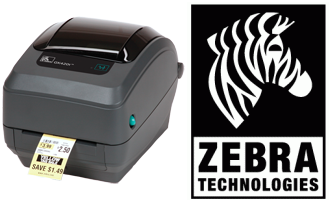

Hi, I'm currently reworking this README file for better presentation.

# Python PCL / ZPL

Python PCL / ZPL allows you to control directly Zebra Printer & HP Printer with ZPL and HP PCL languages from Python.

* It works over an USB connexion or Ethernet connection.
* It has been tested in Windows Environment and currently used under Linux environment.
* Has been designed with Python 2.7 (Raspberry-Pi Friendly)

This library will not try to deal with Raster Printer Driver (AKA Windows way of work). Instead it opens a connection directly to the printer, emit the PCL/ZPL commands and close the connection.

The library just contains a layer of classes to easy the work of PCL/ZPL command emitting.

## What is ZPL?
ZPL is a "tuned version" of PCL for Zebra label printer. Initially started for HP printers, this project evolved to support Zebra ZPL format (used every day on Zebra LP2824 Plus and Zebra GK420t).

## What is PCL?
------------
PCL stand for "Printer Command Line". Meaning that some printer behavior (font, font size, bold, graphics, barcode) can be controled by including some special command inside the text stream being printer. Those special commands are usually introduced by the escape character (ASCII #27). As a result, such printer command are also commonly named "Escape Sequence".  

The advantage of PCL approach is to support advanced printer feature on:
1) Archaic development plateform (eg: Clipper, Habour Projet)
2) Operating Systems having few ressources (Raspberry Pi, MicroControleur, PyBoard)
3) Exactly controling the whole printing process (no drivers stack, no printer spoeler). You can send bytes direcly to the printer? So you are pretty sure to be able to print something.

The inconvenient of such approach is that you have to take care yourself of the printing process, page layout, etc. No software in between (like cups or other document generator) means that you have to do it yourself!     

Aim of this project
-------------------
The aim of this projet is to provide a starting point to print directly on PCL 'like' printers from Python:
* in a effective way,
* on small system (Old computer, pôssibly Raspberry-Pi),
* supporting serial/usb printer, CUPS raw and IP printer.

The projet will target:
* A4 Page printing with a networked HP 3015.
* Adhesive label/tag printing with Zebra
* Ticket printing with Epson  

So here is the starting point of the MCHobby's PythonPcl project.

Which are the PCL printers?
---------------------------
The most known printers are certainly the HP LaserJet.
A wide range of HP Printer support for HP/PCL. We are currently using PCL it to print invoice from an 20 years clipper software still maintained nowadays (compiled with "Harbour project"). We are using a Networked HP3015 and this is working Pretty fine.

Zebra is also proposing PCL support (they call it ZPL for 'Zebra Programming Langage). The general principles stays identical. Zebra did also released many other PCL langages. I did place sereval links into the /res/ressources.txt
I recently bought an affordable Zebra LP 2824 Plus and I have the intention to tame the beast with ZPL.

Epson should also support similar feature but I will examine this point later. (will Epson TM80 been a good choice?)

Brother. As far I know, the only affordable Brother ticket printer (QL-570) is not well supported on Linux machine. Controling that printer directly seems to be a nightmare (even with technical documentation). This is why I did buy a Zebra because they have a ZPL support.

Network Printer or USB/Serial printer
-------------------------------------

--- Network Printer ---
To print on a Network printer, you must use a PrinterSocketAdapter which
abstract communication over the an Ethernet Network.
when creating such adapter, you must give a typle of ('Printer_IP_adress', Printer_port ).
On HP Network printer, the usual printer port is 9100.

--- USB Printer ---
You can also connect an USB printer. In most of the time, such printer
will be taken in charge by CUPS.

To identify such file:
1) Open a terminal.
2) Connect the printer.
3) type de command "dmesg | tail" this will show debug message were
   it will be possible to identify the device path.

example:
[102813.855412] usb 2-1.3: new full-speed USB device number 16 using ehci-pci
[102813.949086] usb 2-1.3: New USB device found, idVendor=0a5f, idProduct=00a3
[102813.949094] usb 2-1.3: New USB device strings: Mfr=1, Product=2, SerialNumber=3
[102813.949100] usb 2-1.3: Product: ZTC LP 2824 Plus
[102813.949105] usb 2-1.3: Manufacturer: Zebra Technologies
[102813.949110] usb 2-1.3: SerialNumber: 36J141701319
[102814.002703] usblp 2-1.3:1.0: usblp0: USB Bidirectional printer dev 16 if 0 alt 0 proto 2 vid 0x0A5F pid 0x00A3
[102814.002745] usbcore: registered new interface driver usblp

We can find the printer by exploring /dev/usb/ .
The printer in our case, the printer is located at /dev/usb/lp0

If you pay attention to the log, usbcore register a new interface driver
named usblp (lp which is the software to print files). So, as you
can see, the printer will be taken in charge by CUPS.

If we want to send command (like ZPL for a Zebra printer) it is very
important to install such printer as a RAW printer.
we describe all those steps and testing in the

 /test/test-printer/zebra/demo*.* files

 ********************************************************************
 * We strongly recommand to read the files                          *
 *   /test/test-printer/zebra/demo-README.txt                       *
 *   /test/test-printer/zebra/demo.zpl                              *
 *   /test/test-printer/zebra/demo-zebra-raw-queue-cups.pdf         *
 *       this last file is in french but you should identify        *
 *       easily the various screen of Raw Queue installation for    *
 *       the Zebra USB printer.                                     *
 ********************************************************************
